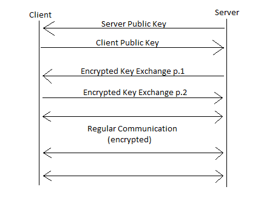
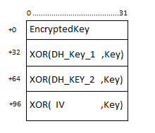

# {{ page.title }}

## 1. Overview

VSEP uses the following Cryptographic Algorithms.

- Curve25519
- AES-128 (Rijndael with 128 Block and Key size)
- CTR-Mode (Block cipher mode)
- [ECFB-Mode](../schemes/ecbc) (Hybrid Block cipher mode)

This Document will use the following notation:

- RandomData = **ChooseRandom**(32 bytes) for random byte creation
- Secret = **Curve**(Public,Base) for elliptic curve Point Muliplication
- **Base** is the base Point of the elliptic curve
- Dest = **XOR**(Source1,Source2,...) XORing something
- SubKey1,SubKey2 = **Split**(Key) splits the 32-byte key into 16 Bytes Sub keys (1..16,17..32)

## 2. Handshake

### 2.1 Server Public Key and Client Public Key

The Server and the Client MUST have a Key Pair. If one of the parties has
no Key Pair it SHALL generate one.

The key Pair is a Curve25519 Key Pair, defined as

<code>PrivateKey = ChooseRandom(32 bytes)</code>

<code>PublicKey = Curve(PrivateKey,Base)</code>

 

### 2.2 Encrypted Key Exchange

<code>OppositePublicKey = the received public key (client or server)</code>

<code>t = ChooseRandom(32 bytes)</code>

<code>EncryptedKey = Curve(t,Base)</code>

<code>Key = Curve(t,OppositePublicKey)</code>

<code>DH_Key_1, DH_Key_2 = curve25519 diffie hellman keys</code>

<code>IV = ChooseRandom(32 bytes)</code>

 

### 2.3 Cipher Setup

<code>Key_1,Key_2 = shared secrets of the Key exchanges.</code>

<code>IV_1 = Decrypted IV from Encrypted Key Exchange p.1</code>

<code>K1S1,K1S2 = Split(Key_1)</code>

<code>IV1S1,IV1S2 = Split(IV_1)</code>

<code>Stream1 = Setup-AES-ECFB(K1S2,IV1S2,Setup-AES-CTR(K1S1,IV1S1))</code>

<code>IV_2 = Decrypted IV from Encrypted Key Exchange p.2</code>

<code>K2S1,K2S2 = Split(Key_2)</code>

<code>IV2S1,IV2S2 = Split(IV_2)</code>

<code>Stream2 = Setup-AES-ECFB(K2S2,IV2S2,Setup-AES-CTR(K2S1,IV2S1))</code>

The Stream1 SHALL encrypt the Server-To-Client Stream.

The Stream2 SHALL encrypt the Client-To-Server Stream.

 

## 3. Security

The Curve25519-DiffieHellman-Key-Exchange is encrypted using Public Keys.
Server and Client can use that to prevent a Man-In-The Middle Attack.

Since the encryption key is exchanged using a DiffieHellman-Key-Exchange,
VSEP offers Perfect forward Secrecy By default.
