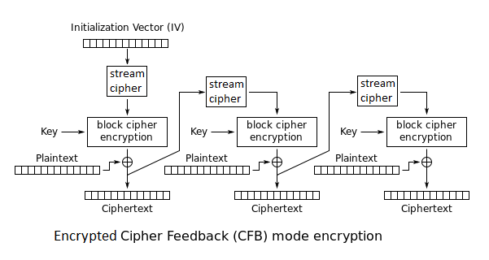
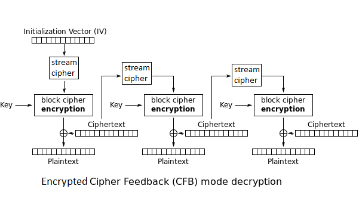

# {{ page.title }}

The encrypted cipher feedback (ECFB) mode,
makes a combination of a block cipher and another
stream cipher into another self-synchronizing stream cipher.
Unlike CFB, it uses another
stream cipher to randomize the cipher feedback.

The stream cipher is initialized with another IV and another key.

(The stream ciphers key and state are not shown is this sketch)

On decoding, both block and stream ciphers are still in encrypt mode.

